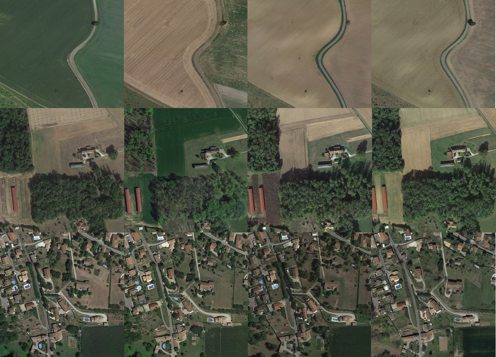

"*.slx" is a simulation model of a fixed wing with a controller. States are noised and we try to do forward prediction using different interpolation technics.
The main goal was to compensate for latency during the processing of the image for VNS and estimate a trajectory with very limited informations.
*************
**A 10go custom DATASET of 10k+ hd satellite images with gps coordinate and different year/season is available on demand**

****************

  

